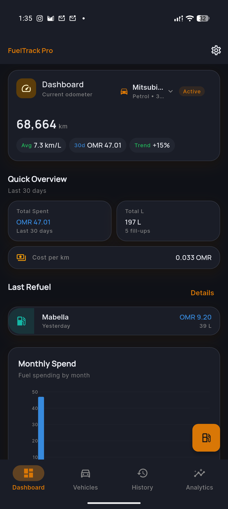
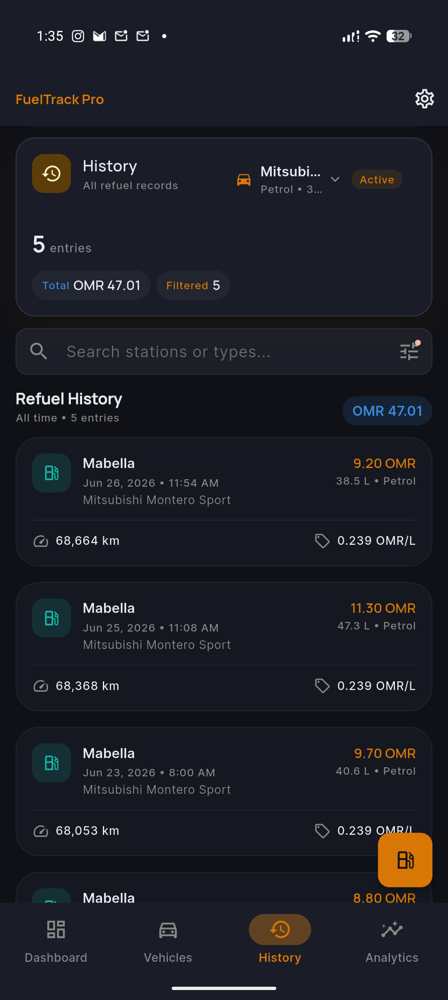
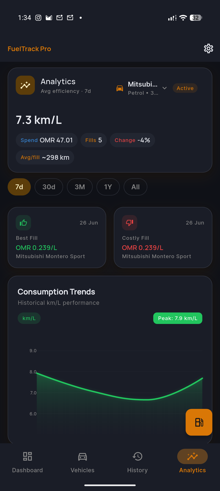
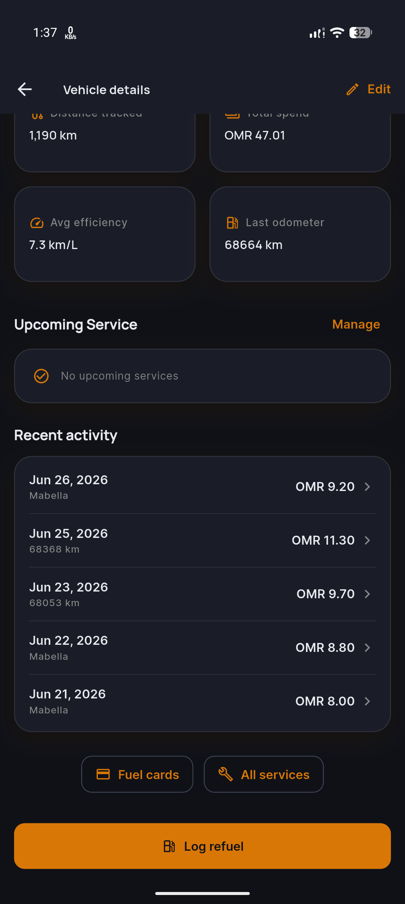

# FuelTrack Pro

**Local-first fuel and vehicle expense tracking for Android.**

Track refuels, measure efficiency, compare stations, and manage a multi-vehicle fleet — on your phone. No account required. Data stays on your device unless you export or back up.

### Download

&nbsp;&nbsp;&nbsp;

 

Obtainium · GitHub Releases · [F-Droid submission guide](FDROID.md)

[All releases](https://github.com/godwintgn/fuel_tracker/releases) · [Website](https://melmidalamapps.fyi/fueltrack/) · [Privacy](https://melmidalamapps.fyi/fueltrack/privacy/)

## Screenshots

| Dashboard | History |
|:--:|:--:|
|  |  |

| Analytics | Vehicle details |
|:--:|:--:|
|  |  |

## Features

- **Multi-vehicle garage** — photo, make/model, registration plate, fuel type (petrol, diesel, EV, CNG, LPG, hybrid)
- **Smart refuel logging** — enter any two of quantity / price-per-unit / total; the third is auto-calculated
- **Timeline validation** — odometer and date checked against neighbors for consistent history
- **Dashboard** — odometer, avg efficiency, monthly spend, efficiency and spend charts
- **History** — searchable list with stable per-vehicle colors, view / edit / delete
- **Analytics** — 7d / 30d / 3M / 1Y / All periods; best/worst fill, station comparison, cost-per-fill chart, multi-vehicle efficiency overlay
- **PDF reports** — filter by period and vehicle; export or share formatted PDF with registration, stations, and refuel history
- **Fuel cards** — fleet-wide or vehicle-specific limits (price or quantity), reset periods, expiry
- **Service reminders** — due by date or odometer, in-app warnings, local notifications
- **Backups** — local JSON backup/restore and optional Google Drive sync
- **Theming** — Material 3 light/dark

## License

Copyright © 2026 [godwintgn](https://github.com/godwintgn)

FuelTrack Pro is free software: you can redistribute it and/or modify it under the terms of the [GNU General Public License v3.0](LICENSE).
